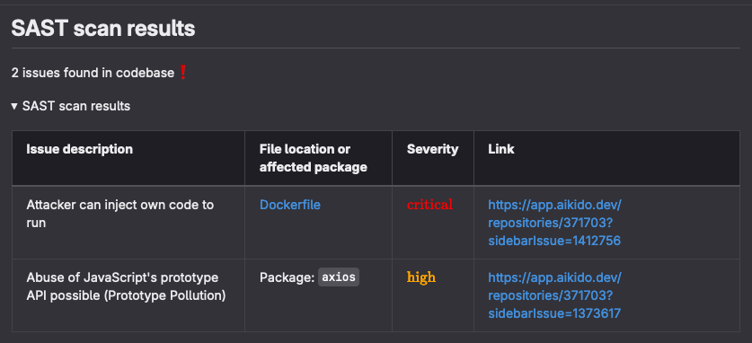

# Aikido-gitlab-MR-commenter-bot

Some small scripts to add aikido results to gitlab merge requests when run in the CICD pipeline.

## Example comment



## Usage

This script is meant to be used in a gitlab pipeline. You can build the image with the provided Dockerfile and use it in your pipeline.

First, you need to build the image:

```bash
docker build -t <base url>/<image name>:latest .
docker push <base url>/<image name>:latest
```

The in your gitlab pipeline, you can run the script to get comments in your MRs:

```yaml
security:secrets:notification:
  # This image adds annotations to the MR with the results of the secret scan
  stage: security:notifications
  needs: ["security:secrets"]
  dependencies:
    - security:secrets
  image: <base url>/<image name>:latest
  script:
    - python /app/aikido_comment_mr.py --gitlab_token $GL_TOKEN
  rules:
    - if: $CI_PIPELINE_SOURCE == 'merge_request_event' && $CI_MERGE_REQUEST_TARGET_BRANCH_NAME == $CI_DEFAULT_BRANCH
      allow_failure: true
    - when: never
  tags:
    - ${RUNNER_TAG}
```

Example of the output in the CICD:

```bash
Getting OAuth token...
Getting code repositories...
Repository ID for <repo name>: <repo id>
Getting all issue groups...
Number of issue groups for <repo name>: 3
Getting issue details...
Filtering high and critical issues...
Number of high and critical issues for <repo name>: 2
```

